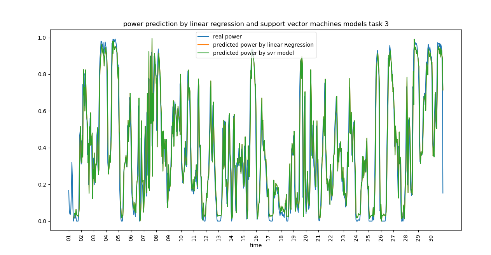

# Energy Consumption Forecasting

This project was done in the context of an assignement at university of Oslo for the module *Energy informatics*. This repository contains code and experiments related to forecasting power generation based on wind-related features. The project explores different regression techniques to model the relationship between environmental conditions and power output, and to forecast future power values based on historical data.

## 🌍 Context

As the world transitions toward renewable energy sources, wind energy plays an increasingly vital role. However, its inherent variability presents challenges in power system planning and grid stability. **Accurate energy forecasting** is crucial for:

- Efficient energy distribution and planning  
- Reducing reliance on fossil fuel backups  
- Improving grid reliability  
- Enabling better integration of renewable sources  

This project aims to explore data-driven approaches to tackle the challenges of wind energy forecasting.

## 🧠 Tasks

- **Task 1**: Learn a regression model that maps wind speed to power generation.
- **Task 2**: Learn a regression model that maps both wind speed and wind direction to power generation.
- **Task 3**: Forecast the next value of power generation without using wind speed or direction. This is done by mapping a window of N previous time steps to the next one in the series.  
  - **Limitation**: The current approach only predicts one step ahead. Other techniques could extend this work by either iteratively shifting the input window or directly forecasting multiple future steps in one shot.
  

## 🔍 Models Evaluated

To solve the tasks outlined above, several regression models were implemented and tested. These include both classical and more flexible machine learning algorithms
- **Linear Regression** : simply model a linear relashionship between inputs and outputs. 
- **k-Nearest Neighbors** (kNN) Regression : a method that first find the k-nearest neighbor of the point we want to predict the output. The target values of these k points are averaged (or weighted-averaged based on their distances to the point) to predict the target value of the point.
- **Support Vector Regression** (SVR) : this method tries to find a linear model between inputs and outputs, but unlike linear regression, only points outside a tube of predefined width are penalized. 
- **Multilayer Perceptron** (MLP) : a fully connected neural network with RelU activation functions

Each model's performance was compared across the three tasks to identify the strengths and limitations of different approaches.

You can see bellow an example of the predicted power generation by linear regression and SVR method as well as the true power generation. This is a quite easy task as we only predict one step ahead, that's why we get very good results :

 

